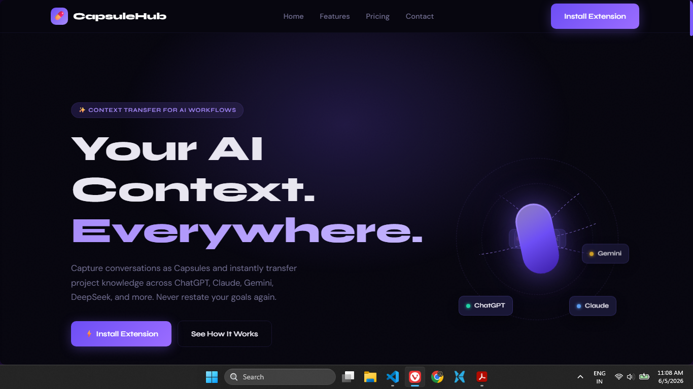
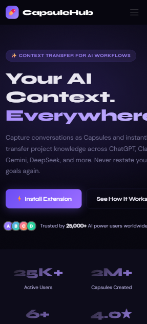
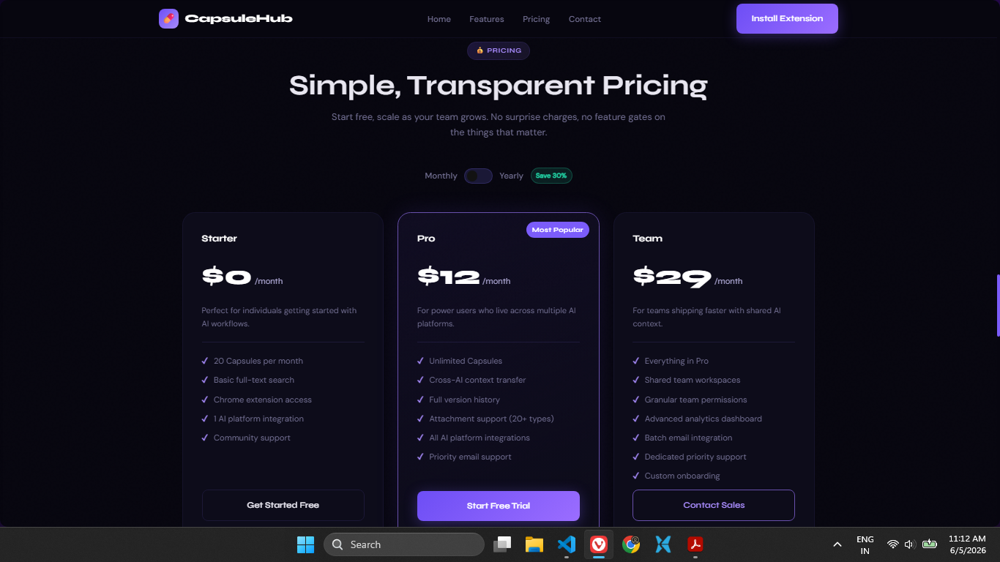
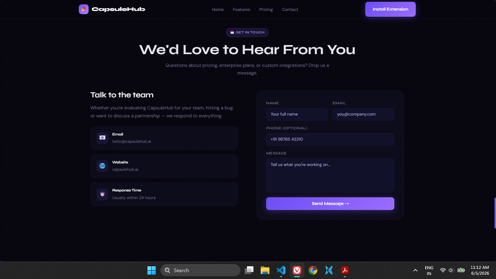

# CapsuleHub — Landing Page


> Task 2: Responsive Business Landing Page  

## Objective

A production-quality landing page for **CapsuleHub by Tilantra** — a Chrome extension that captures AI conversations as reusable Capsules and transfers context across ChatGPT, Claude, Gemini, DeepSeek, and more.

---

## Deployment

> Task 2 - [Business page](https://businesspage-gules.vercel.app)
---

## 📸 Project Screenshots:

| Desktop View | Mobile View |
|---|---|
|  |  |

| Services Section | Contact Form |
|---|---|
|  |  |

## Project Overview

| Field | Detail |
|---|---|
| Task | Task 2 — Responsive Business Landing Page |
| Business Type | SaaS / Chrome Extension (Software Startup) |
| Tech Stack | HTML5, CSS3, Vanilla JavaScript |
| Frameworks | None — core frontend only |
| Deployment | Vercel / Netlify / GitHub Pages |

---

## Features Implemented

- **Sticky navbar** with smooth scroll navigation and mobile hamburger menu
- **Hero section** with animated floating capsule, orbiting AI chips, SVG flow lines, and trust badge
- **Stats bar** — 25K+ users, 2M+ capsules, platform count, Chrome rating
- **Problem section** — 3 pain point cards with hover effects
- **Solution timeline** — 4-step horizontal process with connecting line
- **Features section** — 6 cards with icon, description, and hover glow animation
- **Integrations hub** — radial layout with animated orbit rings and chip cards
- **Pricing section** — 3 tiers (Starter / Pro / Team) with working monthly/yearly billing toggle
- **Testimonials** — 3 realistic cards with avatar, role, and star rating
- **Contact form** — Name, Email, Phone, Message with HTML5 validation and success state
- **Final CTA section** with radial glow background
- **Footer** — logo, 4-column links, social icons, copyright
- **Scroll reveal animations** via IntersectionObserver (staggered delays)
- **CSS variables** for full theming control
- **Mobile-first responsive** layout across all breakpoints

---

## Folder Structure

```
business-landing-page/
├── index.html          # Complete single-file page (HTML + CSS + JS)
├── README.md           # This file
└── screenshots/
    ├── landing-desktop.png
    ├── landing-hero-mobile.png
    ├── landing-services.png
    └── landing-contact-form.png
```

---

## Design Decisions

- **Color system:** Dark navy (`#07060f`) base with purple accent (`#7b5cfa`) — matches CapsuleHub's existing Chrome Store branding
- **Typography:** Syne (headings, 800 weight) + DM Sans (body) — editorial, high-contrast pairing
- **CSS variables:** All colors, radii, and spacing defined in `:root` for easy updates
- **No frameworks:** All layout done with CSS Grid and Flexbox as per task requirements
- **Single file:** CSS and JS inline for zero dependency, instant deployment

---

## Responsive Breakpoints

| Breakpoint | Behaviour |
|---|---|
| `> 860px` | Full desktop layout, hero visual visible |
| `≤ 860px` | Hero visual hidden, nav collapses to hamburger, grids go 2-column |
| `≤ 760px` | All grids go single column, contact form stacks |
| `≤ 520px` | Features grid single column, footer single column |

---

## Screenshots

See `/screenshots` folder.

| View | File |
|---|---|
| Desktop full page | `landing-desktop.png` |
| Hero — mobile view | `landing-hero-mobile.png` |
| Features section | `landing-services.png` |
| Contact form | `landing-contact-form.png` |

---

## Author

**Parth Panchal**  
BTech CSE — KPGU, Vadodara  
Web Development Internship - WeIntern Pvt. Ltd.  
GitHub: [PARTHPANCHAL3656](https://github.com/PARTHPANCHAL3656)  
Email: parthpanchal.10000@gmail.com